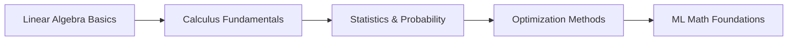

# 🔢 Mathematics with Python

> Exploring mathematical concepts through code—from calculus to linear algebra

## 🎯 Core Topics

### 📊 Statistics & Probability
- Descriptive statistics and data summarization
- Probability distributions (Normal, Binomial, Poisson)
- Central Limit Theorem demonstrations
- Hypothesis testing and confidence intervals

### 🧮 Linear Algebra
- Matrix operations and transformations
- Eigenvalues and eigenvectors
- Singular Value Decomposition (SVD)
- Applications in ML (PCA, dimensionality reduction)

### 📈 Calculus
- Numerical differentiation and integration
- Gradient descent from scratch
- Optimization algorithms
- Multi-variable calculus visualizations

### 🔢 Discrete Mathematics
- Combinatorics and counting principles
- Graph algorithms and network analysis
- Logic and set theory

## 💡 Why This Matters for Data Science

Understanding the math behind ML algorithms helps you:
- Debug models more effectively
- Choose appropriate algorithms for your data
- Optimize hyperparameters with confidence
- Innovate beyond existing libraries

**Requirements:**
- Python 3.8+
- NumPy, SciPy, SymPy
- Matplotlib, Seaborn
- Jupyter Notebook

## 📖 Learning Path

**Recommended Order:**
1. Start with **Linear Algebra** (vectors, matrices)
2. Move to **Calculus** (derivatives, gradients)
3. Study **Statistics** (distributions, inference)
4. Apply to **Optimization** (gradient descent, etc.)

## 🤝 Contributing

Found a bug in my math? Have a better implementation? Open an issue or PR—I'm always learning!

---

**"Mathematics is the language in which the universe is written"** — Galileo

